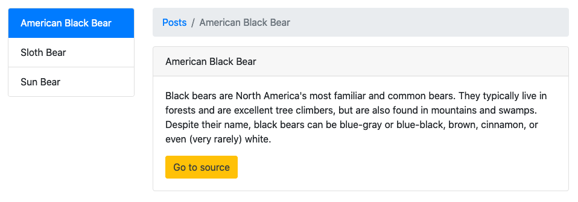

# CSS Frameworks: Common Components & Utilities

## Instructions

To complete this assignment, you will need to make use of the components available in the Bootstrap CSS framework. You will not need to use any components that make use of JavaScript.

You do not need to have the same text as the mockup but the design, including the colors, should be the same.

Build a website that looks similar to the one below. The site does not need to be responsive.

### Mockup

